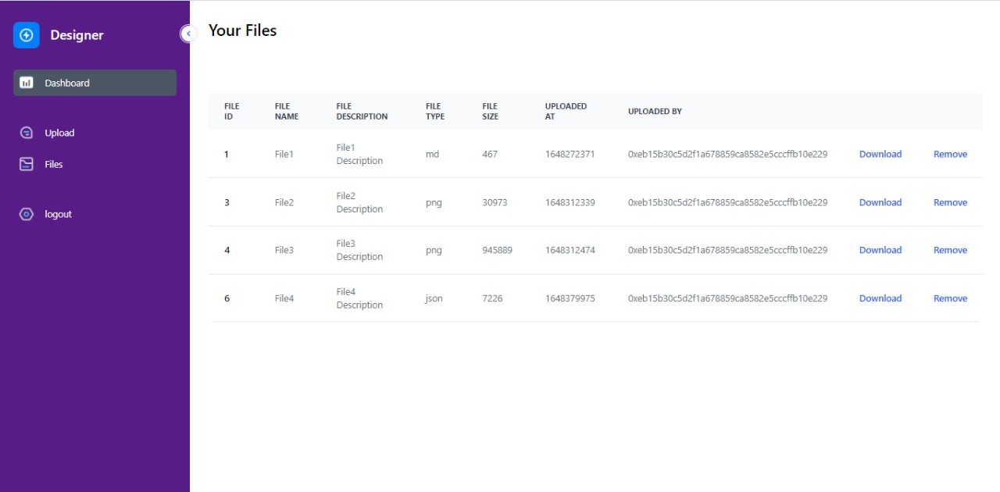

# <pre>          Decentralized File Manager </pre>

## <pre> What is Decentralized File Manager </pre>

A peer-to-peer file manger that lets you upload files, manage and store files on the IPFS.
 It is a decentralized application with additional features to easily manage and upload your files.

## <pre> How to use? </pre>
1. [Visit the File Manager](https://file-manager-daap.vercel.app/)
2. Connect to a wallet

    

3. Upload a File
    
    

4. View your files

    

5. Download the files

6. Remove the files you dont need

